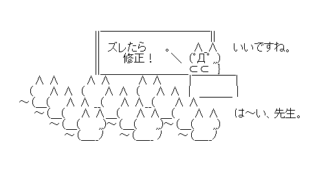

# 👋はじめまして

**RiNgo**🍎というハンドルネームで活動しているヒトです。

## 基本的な属性情報

| Q        | A                                                            |
| -------- | ------------------------------------------------------------ |
| 年齢     | 非公表 ([エヴァQ公開時](https://www.google.com/search?q=%E3%82%A8%E3%83%B4%E3%82%A1Q+%E5%85%AC%E9%96%8B%E6%97%A5)に小学校6年生) |
| 出身地   | 新潟県中越地方                                               |
| 現居住地 | 東京都[多摩ナンバー](https://wwwtb.mlit.go.jp/kanto/soumu/sosiki/sikyoku_syozaiti/tama.html)地域 |
| お仕事   | 池袋に本社があり、世界展開している会社で、末端の底辺プログラマをしてます。 |

## 趣味

🏍️**バイクでツーリングやカスタム**
	**現在のおもちゃ**: [CB125R](s_motorcycle.html)
	**免許取得順**: 原付/普通自動車(AT限)/普通自動二輪(MT)/大型自動二輪(MT)

​	時折、[HondaGO BIKE RENTAL](https://hondago-bikerental.jp/) で乗りたいバイクに乗ってます。

## 各種SNS

私が運営しているSNSアカウント一覧。

| サービス                                                     | アカウントリンク                        |
| ------------------------------------------------------------ | --------------------------------------- |
|  | https://bsky.app/profile/ayase-net.work |
|  | https://twitter.com/55555_Japan         |

(※これ以外のアカウントもあるかも？？)

# My Followers

(*･∀･)／♡＼(･∀･*)

- [【水澄net.com】Intelの趣味のHP](https://www.misumi-net.com/)

古のインターネットにあった『相互リンク』という文化欄です。

## SPECIAL

クソドメインとかネタサイトとかとか

- [インターネット最高！](https://internetsai.co/)
- [金返して](https://kanekae.site/)

