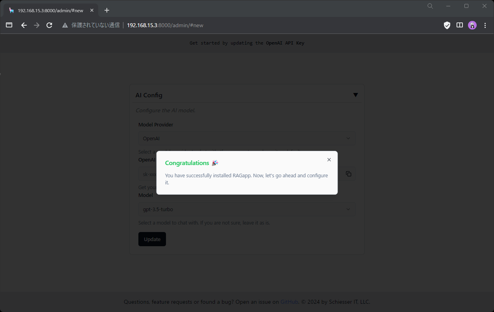
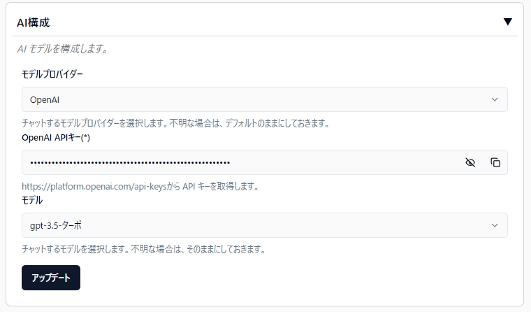
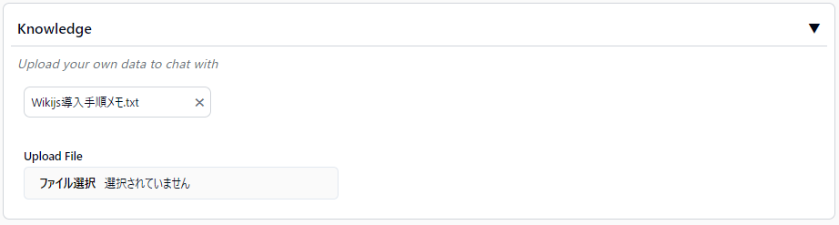
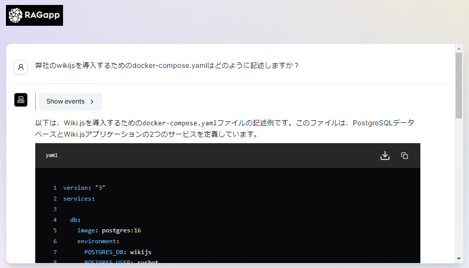
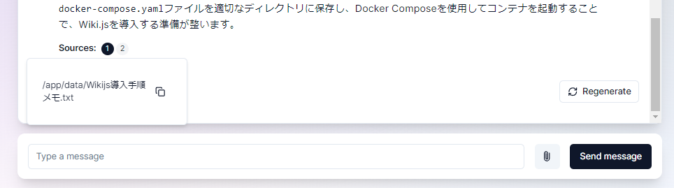

※内容の無断転載は禁止※ URLの共有はOK

# RAGappを建てる

なんかTwitterランド(X)を[TL警備](https://shortanime.hatenablog.jp/entry/2022/08/28/170449#TL%E8%AD%A6%E5%82%99)していたら、[RAGapp](https://github.com/ragapp/ragapp)なるものを発見。
最近、AI漬けになっており、Dockerコンテナで簡単に建てられるので、建ててみる。

※OpenAI社のAPI発行等の手順は本Wikiでは触れていません。

## 1. docker-composeを定義

今回作った定義

```yaml
# docker-compose.yaml

version: '3.8'

services:
  ragapp:
    image: ragapp/ragapp
    ports:
      - "8000:8000"
    environment:
      - SOME_ENV_VAR=your_value
    volumes:
      - ./data:/app/data
    restart: always

networks:
  default:
    driver: bridge
```

## 2. RAGappを起動

1. `docker-compose.yaml`を格納しているディレクトリに移動します。

2. `sudo docker compose up -d` でコンテナを起動します。

   ※問題が発生した場合は`sudo docker compose logs`でログが見られます。

```bash
ayase@tokyo-ubuntu:~/hosting_service/service_ragapp$ sudo docker compose up -d
WARN[0000] /home/ayase/hosting_service/service_ragapp/docker-compose.yaml: `version` is obsolete
[+] Running 1/18
[+] Running 1/18⠀⠀⠀⠀⠀⠀⠀⠀⠀⠀⠀⠀] Pulling
[+] Running 1/18⠀⠀⠀⠀⠀⠀⠀⠀⠀⠀⠀⠀] Pulling
～略～
[+] Running 1/0
[+] Running 1/2vice_ragapp_default     Created
[+] Running 1/2vice_ragapp_default     Created
[+] Running 1/2vice_ragapp_default     Created
[+] Running 1/2vice_ragapp_default     Created
[+] Running 1/2vice_ragapp_default     Created
[+] Running 1/2vice_ragapp_default     Created
[+] Running 2/2vice_ragapp_default     Created
 ✔ Network service_ragapp_default     Created
 ⠦ Container service_ragapp-ragapp-1  Starting
 ✔ Container service_ragapp-ragapp-1  Started
```

↑こんな感じになる。

# RAGappの手順

インストールが完了したら、RAGappのWebGUIで設定をしていきます。

## 1. インストール完了



## 2. OpenAI / Gemin API設定

ここではAIのモデルを選択します。

- OpenAI (OpenAI社 ※Microsoft系)
- Gemini (Google社)

ここではトライアルでGPT-3.5-Turboを使用します。
※費用が発生することに注意が必要です。

[OpenAI API を取得](https://platform.openai.com/)



## 3. RAGに参照させるデータ(.txt)を登録

RAGを用いた回答を行うには、あらかじめ参照(回答)元となる資料を登録する必要があります。ここでは、[Wiki.js 導入TIPS](https://wiki.rin5red.com/ja/oss/wikijs) を.txtデータにしてクリーニングもせずに放り込みました。



## 4. 実際に使ってみる

以下の質問を投げました。

> 弊社のwikijsを導入するためのdocker-compose.yamlはどのように記述しますか？

ここでは、"弊社のwikijs"と書くことで、食わせたデータのユーザ名である`sysbot`が含まれるように誘導しています。



下部に『Source』という項目があり、確認すると食わせたデータを参照していることがわかります。



## 5. さぁ、遊ぼう。

今のところ、AzureOpenAIのエンドポイントには対応していないくさい。
※改造すればイケそうだが。


