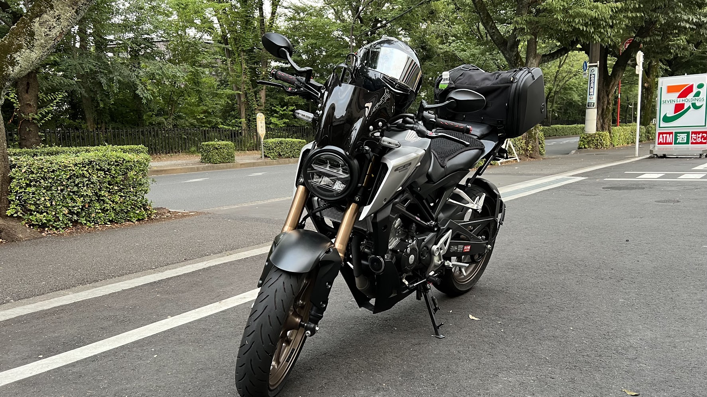
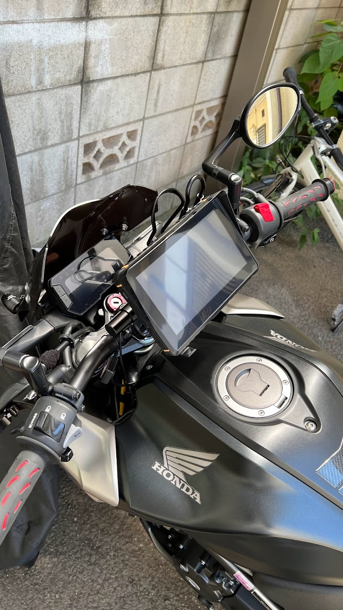

# ぼくのばいく

https://www.honda.co.jp/CB125R/

# カスタム

素人ながら、ちょいちょい弄くってます。

## フェンダーレス

フェンダーレスキットを使用。

## グリップエンド

赤を基調としたグリップエンドを使用。

## フロント風防

フロントに風防を使用。

## リアキャリア

エンデュランス製 タンデムグリップ付きのリアキャリアを使用。

## ドラレコ

Kaedear (カエディア) バイク用 ドライブレコーダー KDR-D711 を使用。

https://www.amazon.co.jp/dp/B0B63V1G2S

## レーザーフォグライト

追突防止・バイクの存在を知らせるため、LEDレーザーフォグライトを使用。

https://www.amazon.co.jp/dp/B06X6FRF5Y

## ナビゲーション

CarPlay対応のスマートディスプレイを設置。

